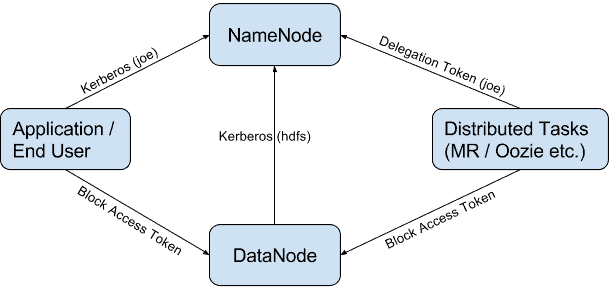
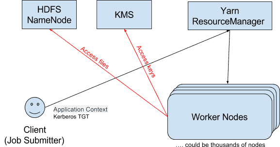
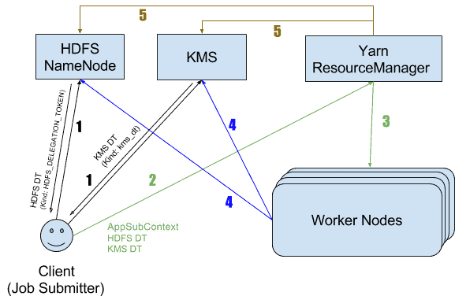
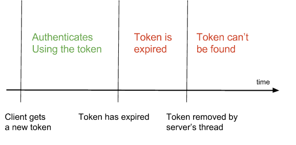

인증 기반으로는 Kerberos가 쓰인다.
Delegation Token, Block Access Token, Trust 과 같은 다른 메커니즘들은 Kerberos를 보완해준다.

### HDFS 인증

HDFS 인증을 간단히 도식화한 그림이다.

- 사용자는 Namenode에 Kerberos 인증을 통해 접근한다.
- 사용자가 제출한 분산 작업은 Delegation Token을 통해 HDFS의 Namenode에 접근할 수 있다.
- HDFS의 Datanode는 NameNode에 Kerberos 인증을 통해 접근한다.
- 사용자나 분산 작업은 Block Access Token을 통해 Datanode에 접근한다.

### Delegation Token

Kerberos를 통해서만 모든 인증을 할 수도 있지만 하둡과 같은 분산 시스템에서는 문제점이 있다.

모든 task가 delegated TGT를 통해 인증을 해야한다면 KDC는 곧바로 bottleneck이 될 것이다.
결국 DDOS 공격이 되는 셈이다.

이러한 점을 해결하기 위해 Kerberos처럼 three party authentication이 아닌, 가벼운 two party authentication protocol인 Delegation Token 인증이 필요했다.

1. 클라이언트는 Kerberos 인증을 하고 서버로부터 DT를 받게 된다.
1. 클라이언트는 서버에 대한 이후의 인증에 대해서는 DT를 사용하게 된다.

클라이언트는 이 DT를 이용해서 다른 작업들이 클라이언트를 대신해서 인증을 하고 작업을 실행할 수 있도록 한다.

DT는 expiration time 있고 주기적인 renewal 을 필요로 한다.
그렇다고 계속해서 renewal 될 순 없고 max lifetime이 존재하고, 또 max lifetime이 되기 전에 삭제할 수도 있다.

DT를 사용하는 것에 있어서의 장점은 다음과 같다.
DT를 사용함으로써 TGT나 키탭을 배포해야하는 필요가 없어졌다.
TGT나 키탭이 중간에 가로채어지게 되면 모든 서비스에 권한이 생기게 되어 위험하다.
반면에 DT는 특정 서비스에 한정되어 있고 무기한으로 사용할 수가 없기 때문에 탈취된다고 해도 위험이 덜하다.
또한 인증 갱신을 할 때 renewer과 서비스만 필요하기 때문에 절차가 가볍고, 토큰 자체는 변하지 않기 때문에 토큰을 사용하던 party들은 그대로 사용하면 된다.

### Server-side의 Delegation Token

여기서 Server는 인증을 하는 주체인 HDFS NameNode나 KMS를 의미한다.
다음의 역할을 수행한다.

- DT를 발급하고 verification을 위해 저장을 한다.
- 갱신 요청이 오면 DT를 갱신한다.
- 클라이언트에 의해 취소 요청이 오거나 만료가 되면 DT를 삭제한다.
- 클라이언트가 인증 요청을 하면 제공 받은 DT와 서버에 저장된 DT를 비교해서 인증을 한다.

DT를 생성하고 인증할 때는 HMAC 메커니즘을 사용하게 된다.
DT가 서버에 저장될 때는 public information이 key이고 private information이 value인 hashmap으로 저장이 된다.

- public information
  - Kind
  - Owner
  - Renewer: 토큰 갱신을 할 수 있는 유저
  - Real User: oozie가 joe라는 유저를 impersonate했다면 owner는 joe이고 real user는 oozie이다.
  - Issue Date
  - Max Date
  - Sequence Number
  - Master Key ID: 마스터 키를 통해 모든 DT를 생성한다. 이 키는 설정된 간격에 따라 roll되고 서버 밖으로 유출되지 않는다.
- private information
  - renewDate
  - password
  - trackingId

renew interval이자 expiration time은 default로 24시간이다.
Expired Delegation Token은 인증을 할 수 없으며 서버에서는 백그라운드 쓰레드에서 만료된 DT를 삭제한다.
max lifetime은 default로 7일이다.

### Client-side Delegation Token

다음과 같은 역할을 한다.

- 서버에게 새로운 DT를 요청하게 되고, 이 요청을 할 때 renewer가 정해진다.
- 본인이 renewer라면 DT를 갱신하도록 서버에 요청하거나, renewer가 아니라면 renewer에게 갱신해달라고 요청을 한다.
- 서버에게 DT를 삭제해달라고 요청을 한다.
- 서버에 인증을 하기 위해 DT를 제공한다.

토큰에 포함된 내용

- Identifier
- password
- kind
- service
- renewer

### Delegation Token의 Lifecycle

1. 클라이언트는 HDFS DT와 KMS DT를 발급받는다.
1. 클라이언트는 YARN RM에 작업을 제출할 때 ApplicationSubmissionContext(AM을 실행시키기 위한 모든 정보가 있는 context)와 함께 DT를 같이 넘겨준다.
1. RM은 토큰을 바로 갱신을 하면서 verify하고 DT와 함께 클러스터의 worker node에 작업을 실행시킨다.
1. 각 worker node는 HDFS 데이터에 접근할 때 HDFS DT를 사용하고 encryption zone의 HDFS 파일을 decrypt하기 위해 KMS DT를 사용한다.
1. 작업이 끝나면 RM은 그 작업에 대한 DT를 삭제하도록 각 서버에 요청한다.

RM은 DT의 expiration time을 체크하면서 90%이상이 되면 갱신한다.

### 토큰 만료

Token is expired 상황

> Caused by: org.apache.hadoop.security.authentication.client.AuthenticationException: org.apache.hadoop.security.token.SecretManager$InvalidToken: token (kms-dt owner=xiao, renewer=yarn, realUser=, issueDate=1508730603474, maxDate=1509335403474, sequenceNumber=7, masterKeyId=69) is expired, current time: 2017-10-22 20:50:12,166-0700 expected renewal time: 2017-10-22 20:50:05,518-0700

토큰이 서버에 아직 저장되어 있을 때 만료된 토큰으로 인증 요청이 온 경우이다.
서버에서 토큰이 만료되자마자 바로 삭제하는 게 아니라 background thread가 주기적으로 제거를 한다.

Token can’t be found in cache 상황

> Diagnostics: org.apache.hadoop.security.authentication.client.AuthenticationException: org.apache.hadoop.security.token.SecretManager$InvalidToken: token (kms-dt owner=xiao, renewer=yarn, realUser=, issueDate=1508730937041, maxDate=1509335737041, sequenceNumber=8, masterKeyId=73) can’t be found in cache

이미 server에서 token을 삭제한 이후에 해당 토큰으로 인증이 온 경우이다.

예상치 못하게 위와 같은 에러를 만난 경우는 server의 로그에서도 sequenceNumber나 token creation/renewal/cancelation 등의 로그를 찾아보면 좋다.

### Long-running application

Max lifetime보다 오래 동작하는 앱의 경우는 다르게 구현해야한다.
Spark의 경우 이런 상황에 대한 대응이 되는데, 토큰을 갱신하는 게 아니라 만료되기 전에 새로운 토큰을 발급받는 방식을 사용한다.
이를 위해서는 스파크 작업이 Kerberos keytab을 갖고 있어야한다.

### 기타

Oozie, Hive, RM 등도 DT를 사용한다.

- Block Access Token
  HDFS 클라이언트가 파일에 접근해야할 때 NameNode에게 block 위치를 받고서 DataNode block에 직접 접근한다. file permission의 경우는 NameNode가 체크를 하지만 이후에도 authorization이 필요할 수 있는데 이 때 Block Access Token이 사용된다. NameNode가 클라이언트에게 발급하고, 클라이언트가 Datanode에 전달을 해주는데 default 10시간의 lifetime을 갖고 갱신되지 않는다. Block Access Token이 만료되면 클라이언트는 새로 발급받아야한다.
- Authentication Token
  DT 보다 더 가볍게 동작하기 위한 Authentication Token 이라는 것도 존재한다. 서버와 클라이언트 사이에 쿠키처럼 동작을 한다. 서버에게 받게 되는데 갱신되거나 impersonate할 수 없다. 그리고 DT와 달리 서버에 일일이 저장될 필요가 없다.

---

References

https://blog.cloudera.com/hadoop-delegation-tokens-explained/
