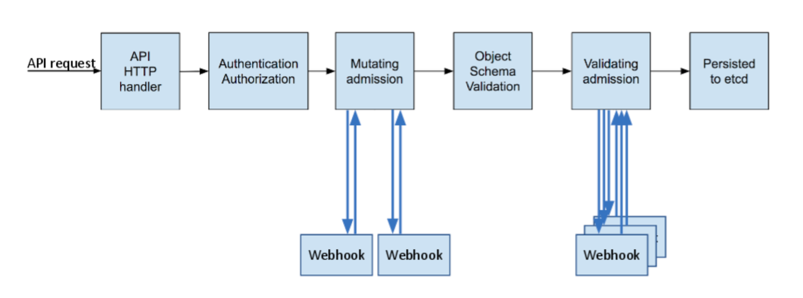

### Authentication/Authorization

일반적으로는 서버에도 인증 정보가 있어서 사용자가 인증을 할 때 서버에 저장된 정보와 비교를 한다. 하지만 쿠버네티스는 내부적으로 인증 정보를 저장하지 않고 각각의 인증 시스템에서 제공해주는 authentication 기능을 활용하여 identify한다. 이를 통해 쿠버네티스에 종속되는 인증이 없어서 쉽게 확장할 수 있다.

쿠버네티스에 그룹이라는 개념이 존재한다. 실제 오브젝트는 아니지만 RoleBinding 리소스 내부에서 string match로 그룹에 따른 권한을 부여할 수 있다. 신규 사용자를 해당 그룹에 속하여 만들게 되면 그룹의 권한을 동일하게 사용할 수 있다.

- system:authenticated: 사용자 인증을 통과한 그룹이다.
- system:anonymous: 사용자 인증을 하지 않은 익명 그룹이다.
- system:masters: 쿠버네티스의 full access 권한을 가진 그룹이다. (admin)

PKI(Public Key Infrastructure)
X.509가 널리 쓰이고 있다.

- Public Private Key: 각 키마다 고유한 역할을 갖는다.
- Certificate: 사용자 정보가 담긴 문서이며 private key 없이 변조가 불가능하다.
- Certificate Authority: 발급한 Certificate를 인증해주는 인증 기관이다.

public key로 암호화하면 그에 매핑되는 private key로만 복호화가 가능하다.
private key로 암호화하면 그에 매핑되는 public key를 이용해서 정말 private key 소유자가 작성한 메세지인지 검증할 수 있다.(digital signature)

public key는 메세지를 암호화하거나 서명된 메세지를 검증하는 기능을 한다.
Certificate는 public 키를 포함한 다양한 인증 정보를 담고 있다.
Certificate에는 문서 전체 내용을 private key를 이용해 서명한 해쉬값이 포함되어 있는데 임의로 변경을 하면 해쉬값이 달라져서 변조된 문서임을 알 수 있다.

인증서에는 issuer 정보가 포함되어 있고 그걸 Certificate Authority(CA)라고 한다. 이 CA 또한 Certificate로 이루어져 있다.
CA도 마찬가지로 CA의 인증서를 발급한 CA가 존재하면 이를 Certificate Chain이라 부른다.
가장 끝에는 Root CA라는 게 있는데 이건 인증 기관이 존재하지 않으며 스스로가 스스로를 인증한다.

Root CA를 만들고 client CA, server CA를 만들어서 인증에 필요한 인증서를 발급한다.
서버 인증서 server.pem과 서버 키 server-key.pem을 넣어서 nginx 컨테이너를 실행시켜본다. 로컬의 8443포트와 컨테이너의 443 컨테이너를 연결한다.

- `curl http://localhost:8443`로 요청하면 http 프로토콜로 서비스하는 게 없으니까 400이 반환된다.
- `curl https://localhost:8443`로 요청하면 인증서가 없으니까 에러가 발생한다.
- `curl -k https://localhost:8443` 하면 tls verification을 건너뛰니까 연결이 된다.
- `curl --cacert rootCA.pem https://localhost:8443` 하면 클라이언트가 가진 rootCA 인증서를 통해 연결이 된다.

이렇게 클라이언트가 서버의 신원을 확인할 수 있게 된다.

서버가 클라이언트를 인증하기 위해서는 인증서 뿐만 아니라 key까지 서버에 전송해야한다.
서버를 인증하는 경우는 클라이언트 입장에서 명시적으로 서버 주소를 입력하니까 서버가 전달하는 서버 인증서의 소유자를 확인할 필요가 없다.
서버 입장에서 클라이언트가 전달하는 클라이언트 CA를 검증할 때는 실제 소유자인지를 확인해야하기 때문에 key가 필요하다.

정리하자면, 클라이언트마다 권한이 명시된 인증서를 가지고 있다.
클라이언트가 인증서와 key값을 포함하여 서버에 전송을 하면 먼저 key 값을 통해 그 인증서가 진짜 그 클라이언트가 보낸 건지 검증을 먼저 하고, 진짜가 맞다면 인증서에 있는 권한 정보를 통해 수행 가능한 요청인지를 확인한다.
이렇듯 서버 입장에서는 클라이언트가 전달한 인증서 내용을 보고 허가를 결정하기 때문에 서버에 사용자 정보를 저장하지 않아도 된다.
클라이언트에게 인증서를 만들어줄 때는 kubernetes root CA와 클라이언트 정보(CN이름이나 group 정보 등)를 통해 인증서를 만들어준다.
예를 들어 `system:masters` 그룹의 인증서를 만들어준다면 해당 새로운 클라이언트는 마스터와 동일한 권한을 갖게 된다.
사용자마다 role을 정의한 json과 root CA를 통해 인증서를 만들어주면 그 사용자는 권한이 정의된 인증서를 통해 작업을 하는 거다.

인증서 발급 예시

```
$ cat > k8s-new-client-csr.json <<EOF
{
  "CN": "k8s-new-client",
  "key": {
    "algo": "rsa",
    "size": 2048
  },
  "names": [
    {
      "O": "system:masters"
    }
  ]
}
EOF

# names.O property에 system:masters 설정

$ cfssl gencert \
  -ca=k8s-rootCA.pem \              # 쿠버네티스 CA 인증서 사용
  -ca-key=k8s-rootCA-key.pem \      # 쿠버네티스 CA key 사용
  -config=rootCA-config.json \
  -profile=root-ca \
  k8s-new-client-csr.json | cfssljson -bare k8s-new-client

$ ls -l
k8s-new-client-csr.json  # 신규 사용자 인증서 csr json
k8s-new-client.pem       # 신규 사용자 인증서
k8s-new-client-key.pem   # 신규 사용자 private key
```

### AdmissionController

- Authentication: 접속한 사람의 신분을 시스템이 인증하는 단계 (신분증 확인)
- Authorization: 누가 어떤 권한을 가지고 어떤 행동을 할 수 있는지 확인하는 단계 (view권한, create권한 등)
- Admission Control: 인증과 권한확인 이후에 추가적으로 요청 내용에 대한 검증이나 요청 내용을 강제로 변경할 때 사용



Authn/Authz 이후에 추가적으로 mutating과 validating을 한다.

빌트인으로 생각하고 있는 쿠버네티스 작업 중 어떤 것들은 admission controller에 의해 관리된다. 예를 들어 네임스페이스가 지워져서 Terminating 상태로 들어가게 되면 NamespaceLifecycle admission controller가 이 네임스페이스에 새로운 오브젝트가 생성되지 않도록 한다. 그니까 실제로 authn/authz 를 통해 가능한 작업이라도 세부적으로, 그리고 현 상황에 맞춰 유연하게 추가적으로 제어를 한다.

admission controller 의 필요성

- Security
  PodSecurityPolicy admission controller는 컨테이너가 root로 실행되는 걸 막을 수 있다.
  이미지 풀을 할 때 특정 registry의 이미지만 허용할 수 있다.
- Governace
  good labels, annotations, resource limits 등을 갖게 할 수 있다.
  dev 배포된 오브젝트들에 대해서는 자동으로 특정 annotation을 추가할 수 있다.
- Configuration Management
  잘못된 설정이 있는지 확인할 수 있다.
  produnction 용도의 이미지에 latest 태그가 붙지 않게 하거나 dev suffix가 붙지 않도록 할 수 있다.

---

References

https://kubernetes.io/docs/reference/access-authn-authz/authentication/
https://kubernetes.io/docs/reference/access-authn-authz/authorization/
https://kubernetes.io/blog/2019/03/21/a-guide-to-kubernetes-admission-controllers/
https://coffeewhale.com/kubernetes/authentication/x509/2020/05/02/auth01/
