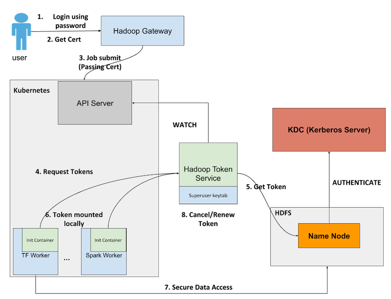
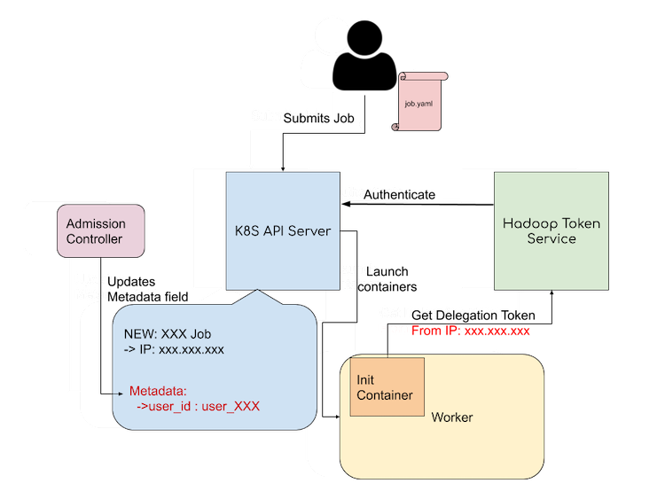
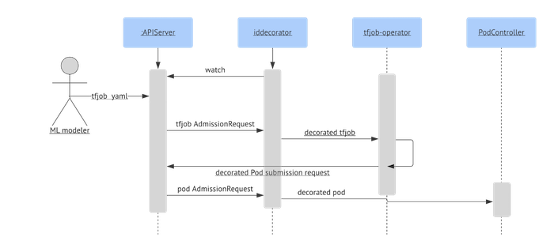
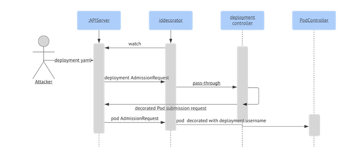
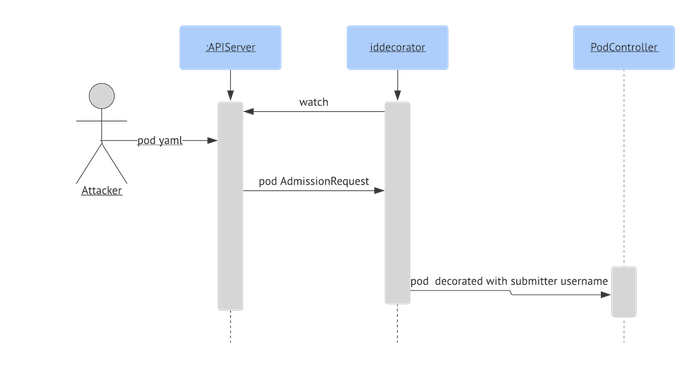

링크드인에서 공개한 오픈소스로서, Kubernetes 안에서 Hadoop Delegation Token을 안전하게 발급받도록 해준다.

### 기존의 상황

하둡은 three-party protocol인 Kerberos를 사용하고 KDC에 bottleneck을 막기 위해 two-party 방식의 Delegation Token을 사용한다.
반면, 쿠버네티스는 인증서 기반의 인증을 사용하고 public-facing api에서 작업의 owner를 노출하지 않는다.
따라서 pod 안에서 기존의 쿠버네티스 API로는 authorized user를 알아낼 수 없기 때문에 HDFS 접근을 위한 Hadoop DT 발급이 어렵다.

### Kube2Hadoop의 전체적인 구조 및 동작 방식

구성 요소

- Hadoop Token Service
  DT 발급을 위한 컴포넌트이고 Kubernetes Deployment로 배포된다. 모든 사용자의 DT를 발급받을 수 있어야 하기 때문에 superuser keytab을 갖고 있다.
- Init Container
  각 worker pod에 있다. Hadoop Token Service에 DT를 받아오는 역할을 한다.
- IDDecorator
  Admission Controller로 배포되어서 authenticated user id를 pod annotation으로 쓰는 역할을 한다.

1. 사용자는 Hadoop Gateway에 본인의 Kerberos로 로그인을 한다.
1. 사용자는 client authentication service으로부터 인증서를 받는다.
1. 인증서를 통해 쿠버네티스에 작업을 제출한다.
1. api server는 인증서를 통해 사용자를 authenticate하고 요청한 컨테이너를 실행시킨다. 각 컨테이너에 있는 init container가 Hadoop Token Service에 DT 를 요청한다.
1. Hadoop Token Service에는 하둡 수퍼유저 키탭이 있어서 요청한 사용자의 DT를 발급받을 수 있다.
1. 받은 DT는 컨테이너 로컬에 저장된다.
1. 트레이닝이 시작되면 DT를 이용해서 HDFS에 접근할 수 있다.
1. Hadoop Token Service는 각 작업의 상태에 watch를 두어서 작업이 끝나면 토큰을 삭제하든가 long running 작업의 경우는 갱신을 한다.

### 인증 메커니즘

- 사용자가 kerberos 인증을 통해 user_id가 principal인 인증서를 발급받고 그 인증서를 통해 작업을 제출한다.
- API server는 기존의 작업 정보 뿐 아니라 인증서의 user_id도 저장 함으로써 api server는 owner of deployment 를 알 수 있다.
- 쿠버네티스 작업이 시작될 때 init container가 Token Service에 DT 요청을 한다.
  (headless account를 사용하는 경우는 DT를 발급받을 때 Token Service는 LDAP 를 조회함으로써 사용자가 해당 account에 대한 권한이 있는지 확인한다.)
- Hadoop Token Service에서는 요청한 init container의 IP를 봐서 API server에 저장되어 있는 해당 작업의 IP와 비교함으로써 다른 pod를 impersonate하지 않았는지 체크한다. 이 절차로 Token Service는 사용자명을 알아낼 수 있고 정상적인 요청이라면 그 사용자에 대한 DT를 발급받는다.

### IDDecorator

IDDecorator는 Admission Controller를 통해 pod annotation에 immutable user-id 를 지속하게 해준다.
init container가 DT 요청을 하면 Token Service는 작업 제출자가 유효한 HDFS 사용자인지 확인하고 headless group을 사용한다면 그 그룹에 속하는지를 확인한다.
사용자 정보를 Token Service에 전달해주는 가장 쉬운 방법은 pod annotation을 통해서이다. 그러나 작업 제출자가 job annotation에 진짜 유저명을 넣었는지 확인하는 게 어렵다.

1. 사용자는 TFJob을 Hadoop Gateway에서 제출한다.
1. api server는 작업의 AdmissionRequest(class)를 IDDecroator mutating admissions webhook으로 보낸다.
1. IDDecorator는 AdmissionRequest를 제출자의 유저명으로 데코레이트한다.
1. IDDecorator는 decorated TFJob을 tf-operator로 보낸다.
1. 작업 operator는 유저명 메타데이터를 pod들에게 전파를 하고 decorated pod submission 요청을 api server로 보낸다.
1. api server는 pod submission을 IDDecorator로 보낸다.
1. IDDecorator는 pod submission 유저명을 override한다.

### Threat Model

- 공격자가 가짜 유저명으로 deployment를 만든 경우
  

1. 공격자가 가짜 유저명으로 job annotation을 적어서 deployment를 api server에 제출한다.
1. IDDecorator는 제출자의 유저명으로 deployment를 decorate함으로써 공격자가 제출한 것을 덮어쓴다.
1. Deployment controller는 decorated pod submission request를 api server로 보낸다.
1. api server는 pod AdmissionRequest를 IDDecorator에게 보낸다.

IDDecorator가 job annotation의 유저명 필드를 deployment controller로 보낸다. pod를 생성할 때 deployment에서 username annotation을 무시하고 제출자의 실제 username으로 덮어씀으로써 fake annotation을 막는다.

- 공격자가 가짜 유저명으로 bare pod를 만든 경우
  

1. 공격자는 가짜 유저명으로 pod를 api server로 제출한다.
1. api server는 pod admissionRequest를 IDDecorator로 보낸다.
1. pod는 제출자의 유저명으로 decorate되어서 가짜 유저명이 덮어쓰여진다.

- 공격자가 Kubernetes Admin을 탈취한 경우

Kubernetes admin 계정을 탈취한 경우, 공격 범위를 최대한 줄이기 위해서 Hadoop Token Service를 Kubernetes Platform 밖에 따로 두는 것을 권장한다.

### why kube2hadoop

사용자가 작업 제출 전에 DT를 받아와서 kubernetes에 작업을 제출할 때 Secret object로 DT를 전달할 수도 있다. 하지만 이렇게 오브젝트로 제출하게 되면 그 네임스페이스의 다른 사용자도 오브젝트에 접근을 할 수가 있다. 다른 사용자의 접근 제어를 하려면 사용자마다 일일이 RBAC(Role-based access control)을 해야하는데 복잡도가 너무 올라간다. 또한 작업이 끝나고 나면 그 Object를 삭제해줘야하는 추가 작업이 필요하기 때문에 kube2hadoop에 비해 비효율적이다.

---

Refereces

https://engineering.linkedin.com/blog/2020/open-sourcing-kube2hadoop
https://github.com/linkedin/kube2hadoop
https://www.altoros.com/blog/linkedin-aims-to-deploy-thousands-of-hadoop-servers-on-kubernetes/
https://www.datanami.com/2020/06/10/linkedin-open-sources-kube2hadoop/
https://www.youtube.com/watch?v=VFIwJrkFw1s&t=1256s
